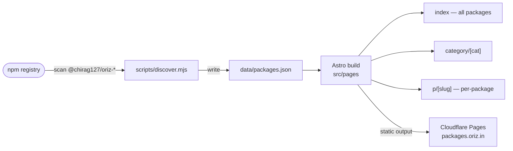

# Oriz Packages Catalog

> Auto-discovery catalog of every `@chirag127/oriz` npm package — one card per package, built from the live npm registry.

[](./LICENSE)
[](https://github.com/chirag127/packages/stargazers)
[](https://github.com/chirag127/packages/commits/main)
[](https://astro.build)
[](https://github.com/chirag127/packages/actions/workflows/ci.yml)

## What it is / why it exists

The oriz fleet publishes a growing set of `@chirag127/oriz-*` npm packages, and keeping a hand-maintained list of them in sync is a losing battle. This site makes the **npm registry the single source of truth**: a build-time discovery script scans npm for every matching package and writes `data/packages.json`, and the Astro site renders a searchable card per package with category and per-package detail pages. Publish a new package and it shows up on the next build — no manual edits.

**Live site:** [packages.oriz.in](https://packages.oriz.in) · **Repo:** [github.com/chirag127/packages](https://github.com/chirag127/packages)

⭐ If this is useful, please **star the repo** — it helps others find it.

## How it works



`pnpm dev` / `pnpm build` both run `discover` first, so the data is always refreshed before the site is generated. Output is fully static and deploys to Cloudflare Pages.

## Features

- **Zero-maintenance catalog** — packages are discovered from npm, not hand-listed.
- **Per-package detail routes** (`p/[slug]`) and **category pages** (`category/[cat]`).
- **Search** across the catalog.
- **Static output** — fast, cacheable, cheap to host.
- **Shared oriz chrome** via `@chirag127/astro-chrome` for consistent header/footer/nav across the fleet.

## Tech stack

- **Astro 6** — static site generation, per-package + per-category routes.
- **TypeScript** — data layer (`src/lib/data.ts`) and typechecking (`astro check`).
- **pnpm** (v10) — package manager; Node >= 22.12.
- **`@chirag127/astro-chrome`** — shared layout/nav components.
- **Inter / Inter Tight / JetBrains Mono** (Fontsource) + **sharp** for images.
- **Cloudflare Pages** — hosting (`wrangler.toml`), deployed via GitHub Actions.

## Repo structure

```
src/
  pages/            # routes: index, p/[slug], category/[cat], + static pages
  components/       # Astro components — Header, Footer, Sidebar, PackageCard, Layout
  lib/data.ts       # loads + types the generated catalog
  styles/global.css
scripts/discover.mjs # npm registry scanner → data/packages.json
data/packages.json   # generated catalog data (source of truth = npm)
knowledge/           # app-specific docs
docs/                # CNAME for packages.oriz.in
astro.config.mjs · wrangler.toml
```

## Quick start

```bash
pnpm install
pnpm dev        # runs discover, then astro dev
pnpm build      # runs discover, then astro build (static output)
pnpm preview    # preview the production build
pnpm typecheck  # astro check

node scripts/discover.mjs   # refresh data/packages.json only
```

## Part of the oriz family

This catalog is one of ~80 sites and tools in the **oriz** family, and it indexes the fleet's own npm packages. See the rest at [blog.oriz.in](https://blog.oriz.in).

## Cost

**$0 on the Cloudflare Pages free tier** — static output, no server.

## Contributing

Issues and PRs welcome — see [CONTRIBUTING.md](./CONTRIBUTING.md). The catalog data is generated; to add a package, publish it to npm under `@chirag127/oriz-*` and it appears on the next build.

## Status

Stable and deployed at [packages.oriz.in](https://packages.oriz.in). Roadmap: richer per-package metadata (downloads, badges) and improved search.

## License

[MIT](./LICENSE) © 2026 Chirag Singhal · [chirag@oriz.in](mailto:chirag@oriz.in)

_Conventional commits are the changelog._
